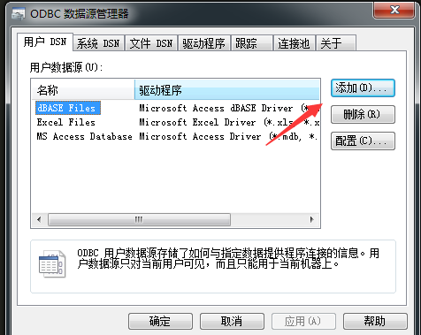
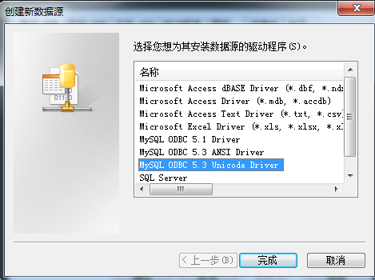
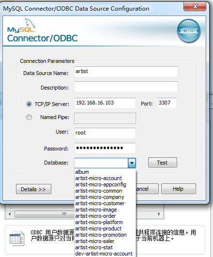
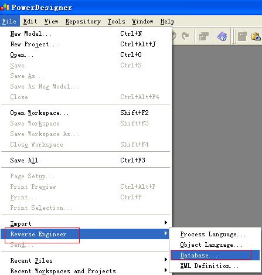
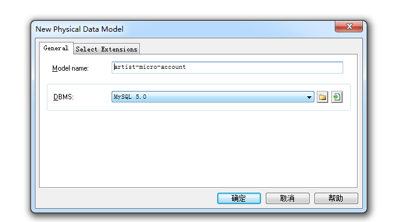
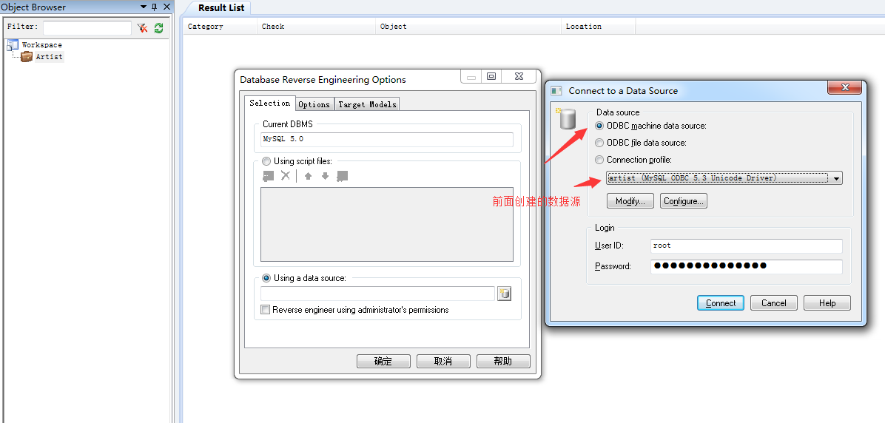
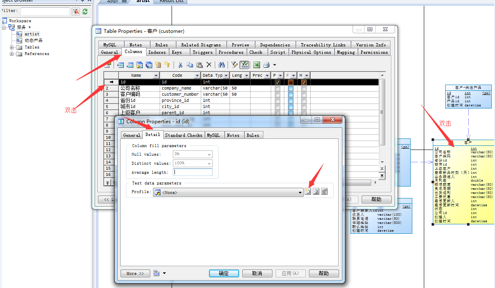
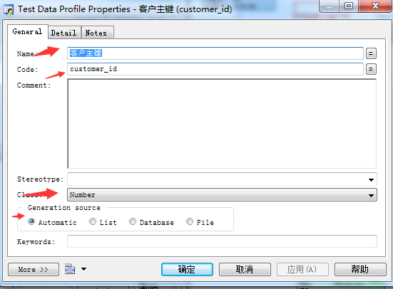
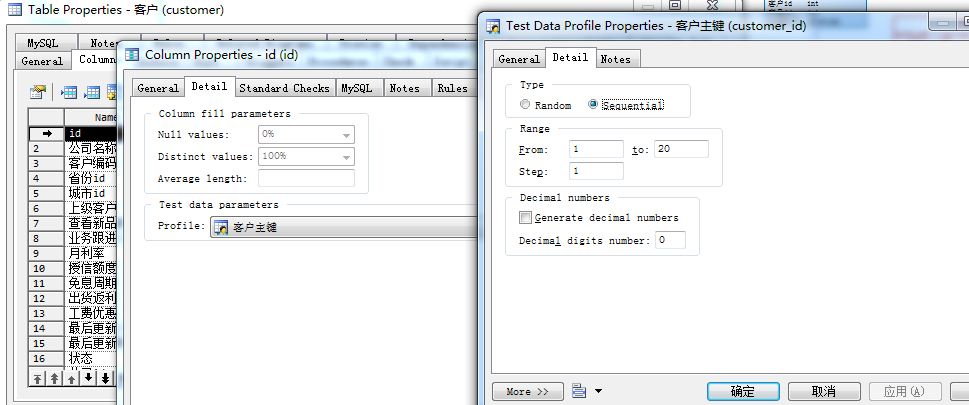
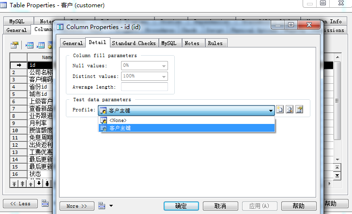

# Powerdesigner 生成测试数据
    根据pdm生成测试数据，pdm可以通过数据库逆向获得，也可以直接的pd中创建
## 参考资料
 [PowerDesigner 数据库生成物理数据模型 生成数据库测试数据](http://blog.csdn.net/kalision/article/details/41890855)
##  配置数据源

[下载mysql驱动](https://dev.mysql.com/downloads/connector/odbc/5.1.html) 这里下载5.1.13 
针对MySQL5.0系列版本需要安装mysql-connector-odbc-5.1.8，这里没有什么选择项，直接“下一步”就行。安装好后，打开控制面板 | 管理工具 | 数据源(ODBC)
 
 
 
 
 此处选择dev-artist-micro-account
 即可看到显示的数据

## 数据库反向工程
数据源建好后打开PowerDesigner，选择File | Reverse Engineer |Database…，如下图：

你可以为物理数据模型命名，确定即可，这里我命名为artist-micro-account，接着点击红色箭头处配置数据源：：

点击确定，报下面的错

[Microsoft][ODBC 驱动程序管理器] 在指定的 DSN 中，驱动程序和应用程序之间的体系结构不匹配

原因：数据库驱动不匹配，系统64位，驱动64位，可能mysql是32位的
解决：卸载不匹配的驱动，安装匹配的驱动

## 配置测试数据摘要文档

这一步相当于是制定你的测试数据生成规则，可以单独做也可以和下一步“应用测试数据摘要文档”一起做，单独做的话点击Model | Test Data Profile…，不过我个人更建议和下一步一起做，因为那样使你更加明确需要配置哪些测试数据摘要文档。
## 应用测试数据摘要文档
在PowerDesigner PDM模型下双击Table，Columns选项卡下再双击相应字段，如下：

这里为id列创建的测试数据摘要文档名为Number,是Number类型，自动产生。其中这里有三种类型可以选择，分别是：Number（数值型）、Character（字符型）、Data&Time（日期时间型）
"Generaction Source"为数据产生的方式

点击"detail"可以指定更细致的规则，这里序列的方式为从1递增到20，步长为1

制定摘要文档完成后确定回到Column Properties - id选项板下，为列应用摘要文档，如下

