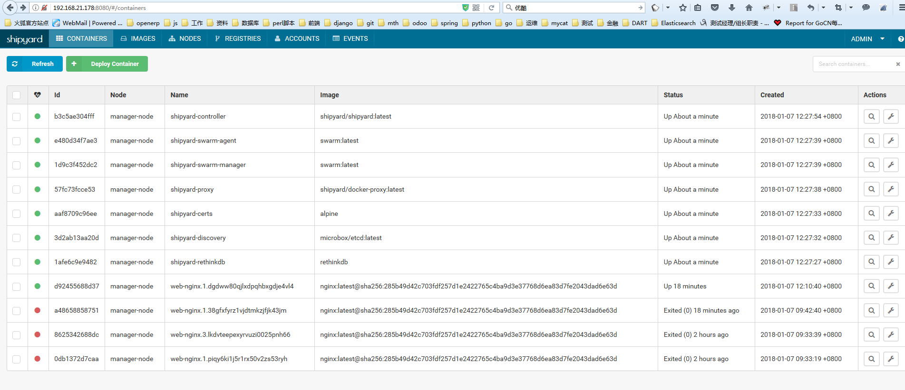
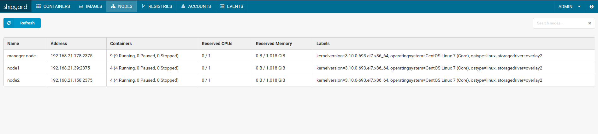
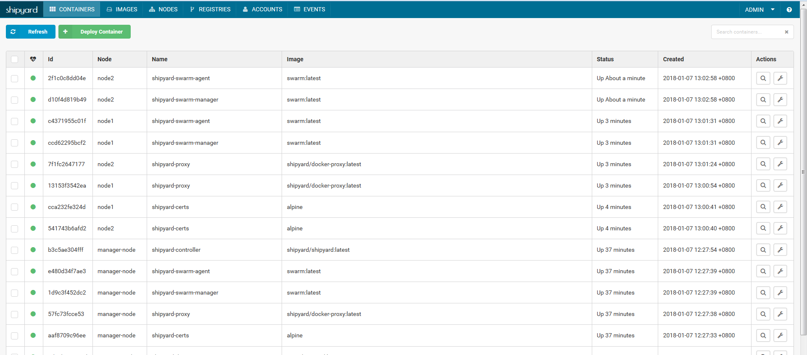
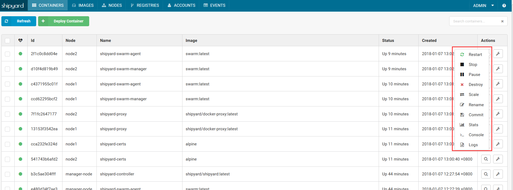
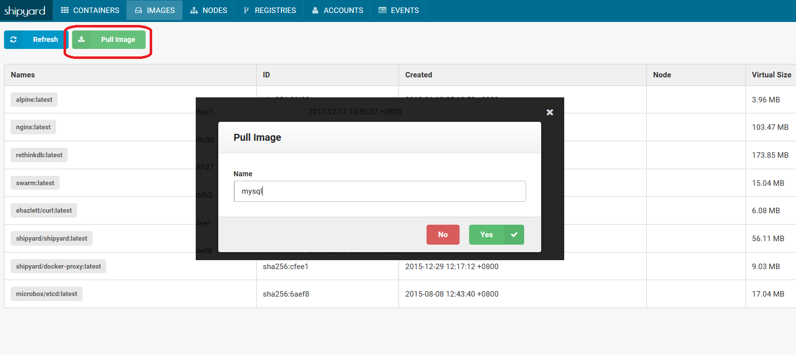
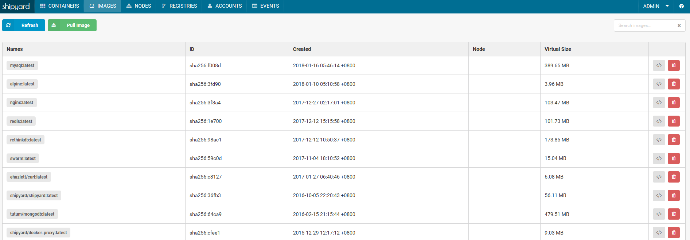
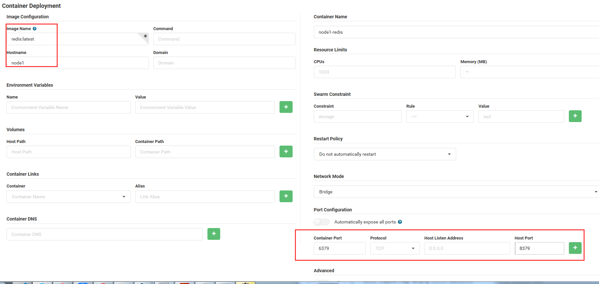

# Docker集中化web界面管理平台-Shipyard

Shipyard（github）是建立在docker集群管理工具Citadel之上的可以管理容器、主机等资源的web图形化工具,包括core和extension两个版本，core即shipyard主要是把多个 Docker host上的 containers 统一管理（支持跨越多个host），extension即shipyard-extensions添加了应用路由和负载均衡、集中化日志、部署等;Shipyard是在Docker Swarm实现对容器、镜像、docker集群、仓库、节点进行管理的web系统。

---------------------Shipyard---------------------

功能：简化对横跨多个主机的Docker容器集群进行管理

通过Web用户界面，你可以大致浏览相关信息，比如你的容器在使用多少处理器和内存资源、在运行哪些容器，还可以检查所有集群上的事件日志。

其特性主要包括：

* 支持节点动态集群，可扩展节点的规模（swarm、etcd方案）
* 支持镜像管理、容器管理、节点管理等功能
* 可视化的容器管理和监控管理
* 在线容console终端

## 了解Shipyard几个概念
	
* engine

    一个shipyard管理的docker集群可以包含一个或多个engine（引擎），一个engine就是监听tcp端口的docker daemon。

    shipyard管理docker daemon、images、containers完全基于Docker API，不需要做其他的修改。

    另外，shipyard可以对每个engine做资源限制，包括CPU和内存；因为TCP监听相比Unix socket方式会有一定的安全隐患，

    所以shipyard还支持通过SS

    证书与docker后台进程安全通信。
  
* rethinkdb
    RethinkDB是一个shipyard项目的一个docker镜像，用来存放账号（account）、引擎（engine）、服务密钥（service key）、
    扩展元数据（extension metadata）等信息，但不会存储任何有关容器或镜像的内容。

## Shipyard生态
    shipyard是由shipyard控制器以及周围生态系统构成，以下按照deploy启动顺序进行介绍（下面几个就是shipyard使用脚本安装后，启动的几个容器名）
    1）RethinkDB
    deploy首先启动的就是RethinkDB容器，shipyard采用RethinkDB作为数据库来保存用户等信息
    
    2）Discovery
    为了使用Swarm，我们需要一个外部的密钥值存储群容器，shipyard默认是采用了etcd。
    
    3）shipyard_certs
    证书管理容器，实现证书验证功能
    
    4）Proxy
    默认情况下，Docker引擎只监听Socket，我们可以重新配置引擎使用TLS或者使用一个代理容器，转发请求从TCP到Docker监听的UNIX Socket。
    
    5）Swarm Manager
    Swarm管理器
    
    6）Swarm Agent
    Swarm代理，运行在每个节点上。
    
    7）Controller
    shipyard控制器，Remote API的实现和web的实现。
## 使用阿里云镜像加速器 
[阿里云地址](https://cr.console.aliyun.com/#/accelerator)
## 下载镜像 （这些镜像其实可以不用提前下载，执行下面安装shipyard的命令后就会自动下载这些镜像）
<pre><code>
[cloudy@manager-node ~]$ docker pull alpine
[cloudy@manager-node ~]$ docker pull library/rethinkdb
[cloudy@manager-node ~]$ docker pull microbox/etcd
[cloudy@manager-node ~]$ docker pull shipyard/docker-proxy
[cloudy@manager-node ~]$ docker pull swarm
[cloudy@manager-node ~]$ docker pull shipyard/shipyard
</code></pre>
## 安装shipyard
    shipyard的部署非常简单，官方提供了在线的脚本通过命令进行安装，使用"curl -s https://shipyard-project.com/deploy | bash -s" 命令进行安装即可。
    deploy实际上是一个shell脚本，实现docker run启动shipyard依赖的容器。如果觉得每次通过curl启动不方便也可以将这个脚本下载到本地磁盘进行操作。
    启动完成以后，在浏览器输入http://192.168.21.178:8080即可访问，默认用户名为admin密码为shipyard。
    注意：由于deploy在执行时需要访问/var/run/docker.sock，所以需要root权限，或者为该文件添加权限。
<pre><code>    
curl -s https://shipyard-project.com/deploy | bash -s
.........
.........
Shipyard available at http://192.168.21.178:8080
Username: admin Password: shipyard
</code></pre>

打开浏览器

	
注意一下：
    1）最好关闭防火墙
    2）添加 Node 节点可能失败，可以进行多次尝试
    
    ---------------------------------------------------------------------------------------------------------------
    上面安装shipyard的脚本是英文版的，其实还有中文版的脚本，下面两种都可以使用：
    
    1）安装shipyard
    # curl -sSL http://dockerclub.net/public/script/deploy |  bash -s                      ==> 中文版
    # curl -sSL https://shipyard-project.com/deploy | bash -s                              ==> 英文版
    
    2）添加node节点
    # curl -sSL http://dockerclub.net/public/script/deploy | ACTION=node DISCOVERY=etcd://<shipyard部署机ip> bash -s                ==> 中文版
    # curl -sSL https://shipyard-project.com/deploy | ACTION=node DISCOVERY=etcd://<shipyard部署机ip> bash -s                       ==> 英文版
    
    3）删除shipyard（在节点机上执行，就会将节点从shipyard管理里踢出）
    # curl http://dockerclub.net/public/script/deploy | ACTION=remove bash -s                   ==> 中文版
    # curl -sSL https://shipyard-project.com/deploy | ACTION=remove bash -s                     ==> 英文版
    ---------------------------------------------------------------------------------------------------------------
    
    其他：
    1）如果想将安装重新来一遍
    [cloudy@manager-node ~]$ for i in `docker ps |sed '1d'| awk '{print $NF}'`;do docker rm -f $i; done
    [cloudy@manager-node ~]$ docker stop `docker ps -a -q`
    [cloudy@manager-node ~]$ docker rm `docker ps -a -q`
    [cloudy@manager-node ~]$ curl -s https://shipyard-project.com/deploy | bash -s
    
    2）停止运行镜像
    [cloudy@manager-node ~]$ docker stop shipyard-proxy shipyard-certs shipyard-discovery shipyard-rethinkdb shipyard-swarm-agent shipyard-swarm-manager shipyard-controller
    
    3）启动运行的镜像
    [cloudy@manager-node ~]$ docker start shipyard-proxy shipyard-certs shipyard-discovery shipyard-rethinkdb shipyard-swarm-agent shipyard-swarm-manager shipyard-controller
    
    4）查看运行的docker进程
   [cloudy@manager-node ~]$ docker ps
        CONTAINER ID        IMAGE                          COMMAND                  CREATED             STATUS              PORTS                                            NAMES
        b3c5ae304fff        shipyard/shipyard:latest       "/bin/controller --d…"   8 minutes ago       Up 8 minutes        0.0.0.0:8080->8080/tcp                           shipyard-controller
        e480d34f7ae3        swarm:latest                   "/swarm j --addr 192…"   8 minutes ago       Up 8 minutes        2375/tcp                                         shipyard-swarm-agent
        1d9c3f452dc2        swarm:latest                   "/swarm m --replicat…"   8 minutes ago       Up 8 minutes        2375/tcp                                         shipyard-swarm-manager
        57fc73fcce53        shipyard/docker-proxy:latest   "/usr/local/bin/run"     8 minutes ago       Up 8 minutes        0.0.0.0:2375->2375/tcp                           shipyard-proxy
        aaf8709c96ee        alpine                         "sh"                     8 minutes ago       Up 8 minutes                                                         shipyard-certs
        3d2ab13aa20d        microbox/etcd:latest           "/bin/etcd -addr 192…"   8 minutes ago       Up 8 minutes        0.0.0.0:4001->4001/tcp, 0.0.0.0:7001->7001/tcp   shipyard-discovery
        1afe6c9e9482        rethinkdb                      "rethinkdb --bind all"   8 minutes ago       Up 8 minutes        8080/tcp, 28015/tcp, 29015/tcp                   shipyard-rethinkdb
        d92455688d37        nginx:latest                   "nginx -g 'daemon of…"   25 minutes ago      Up 25 minutes       80/tcp                                           web-nginx.1.dgdww80qjlxdpqhbxgdje4vl4
            
    5）使用自定义shipyard镜像镜像
    [cloudy@manager-node ~]$ curl -sSL https://shipyard-project.com/deploy | IMAGE=shipyard/shipyard:test bash -s

## 添加node节点的操作
添加192.168.21.39和192.168.21.158 作为节点。那么就需要分别在这两台台机器上执行下面的命令：
<pre><code>
curl -sSL https://shipyard-project.com/deploy | ACTION=node DISCOVERY=etcd://192.168.21.178:4001 bash -s
</code></pre>
 
1）上面命令中的192.168.21.178是shipyard的部署机的ip；
2）192.168.21.178机器的iptables防火墙要打开4001端口。最好是关闭防火墙
  
* 节点查看

* 容器查看

* 可以在shipyard页面里做所添加的节点机里的docker容器进行关闭、删除、重启、重命名、提交新镜像、状态和日志查看能操作，如下：

* 添加镜像

* 容器部署

