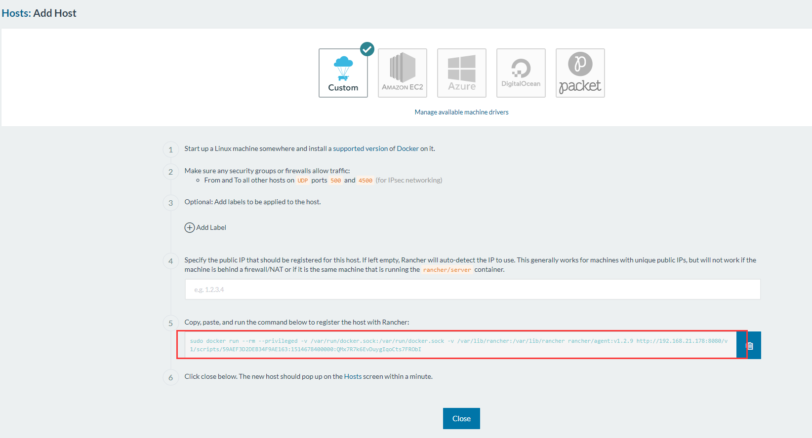
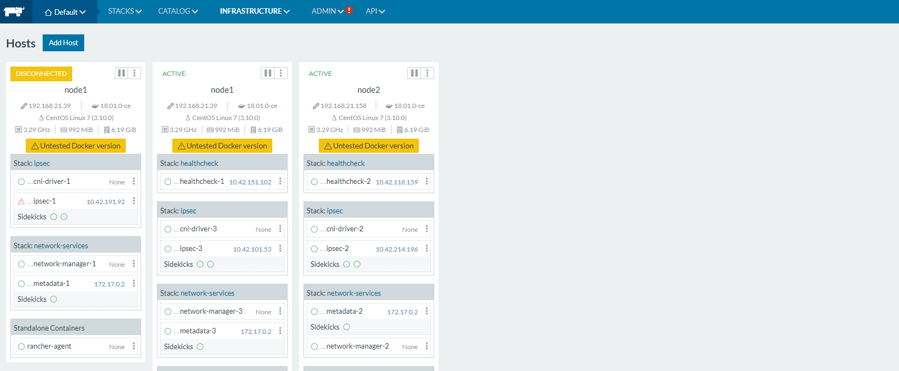
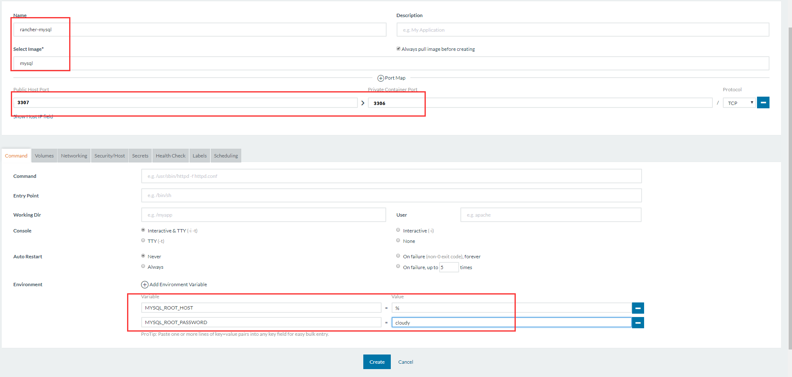
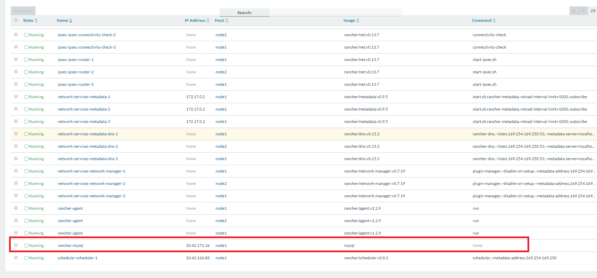

# Rancher安装

## Rancher　Server安装
* 启动 rancher server

    ip地址为：192.168.21.178
    <pre><code>[cloudy@manager-node ~]$ docker run -d --restart=unless-stopped -p 8080:8080 rancher/server:stable
    Unable to find image 'rancher/server:stable' locally
    stable: Pulling from rancher/server
    bae382666908: Pull complete 
    29ede3c02ff2: Pull complete 
    da4e69f33106: Pull complete 
    8d43e5f5d27f: Pull complete 
    b0de1abb17d6: Pull complete 
    422f47db4517: Pull complete 
    79d37de643ce: Pull complete 
    69d13e08a4fe: Pull complete 
    2ddfd3c6a2b7: Pull complete 
    bc433fed3823: Pull complete 
    b82e188df556: Pull complete 
    dae2802428a4: Pull complete 
    a6247572ea3c: Pull complete 
    884c916ebae4: Pull complete 
    85517c9c5365: Pull complete 
    02dded9fe690: Pull complete 
    fd9f433c3bc6: Pull complete 
    44d91b3fea45: Pull complete 
    0d463387dfeb: Pull complete 
    60753c4d26f0: Pull complete 
    a003892966fe: Pull complete 
    Digest: sha256:42441f0128fae4d72d51f92de2049392427d462356282a46f28434332967c7e4
    Status: Downloaded newer image for rancher/server:stable
    13273d0de8567b94b6412057f4cd65a15d1dd0ad2c295cdc98b48b35cc35c891
</code></pre>
* 日志查看
    <pre><code>[cloudy@manager-node ~]$ sudo docker logs -f <CONTAINER_ID></code></pre>
* 浏览器查看
 
* 添加主机
     
     点击确认
     
     复制图中的内容到另外两台机器(192.168.21.39,192.168.21.158,已经安装好docker,版本和178一直)上运行
     <pre><code>[cloudy@node1 ~]$  sudo docker run --rm --privileged -v /var/run/docker.sock:/var/run/docker.sock -v /var/lib/rancher:/var/lib/rancher rancher/agent:v1.2.9 http://192.168.21.178:8080/v1/scripts/59AEF3D2DEB34F9AE163:1514678400000:QMx7R7k6EvDuygIqoCts7FRObI</code></pre>
     
* 添加容器

