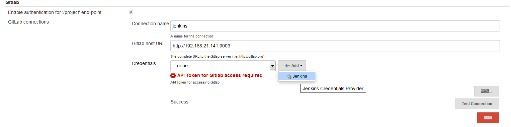
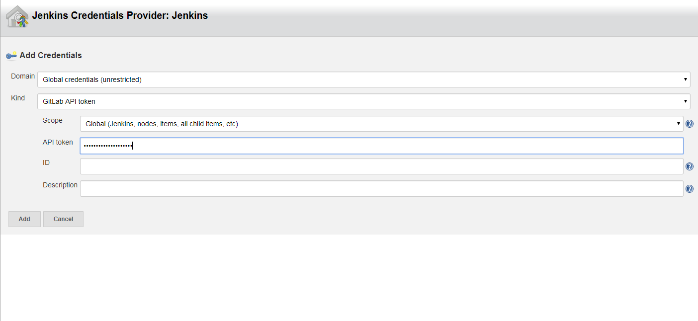
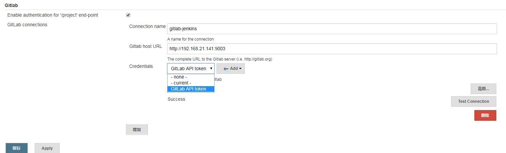
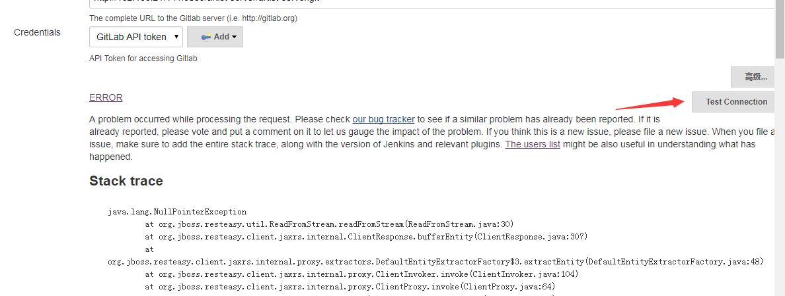
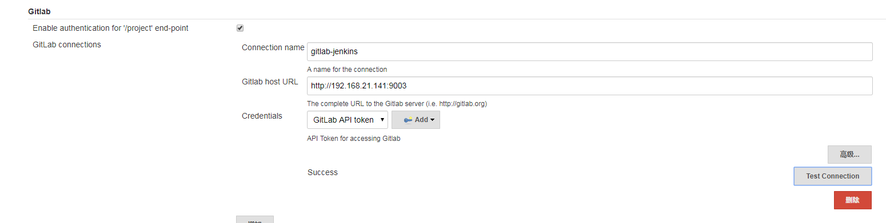
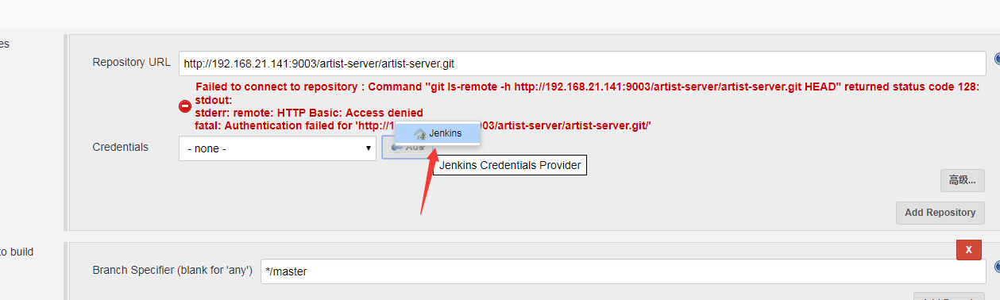
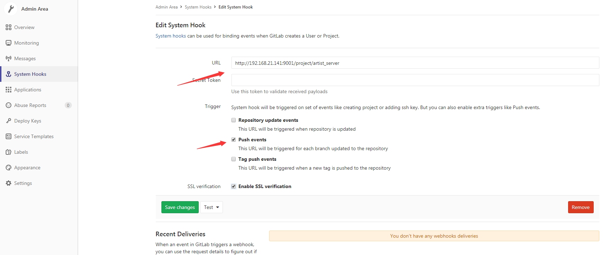
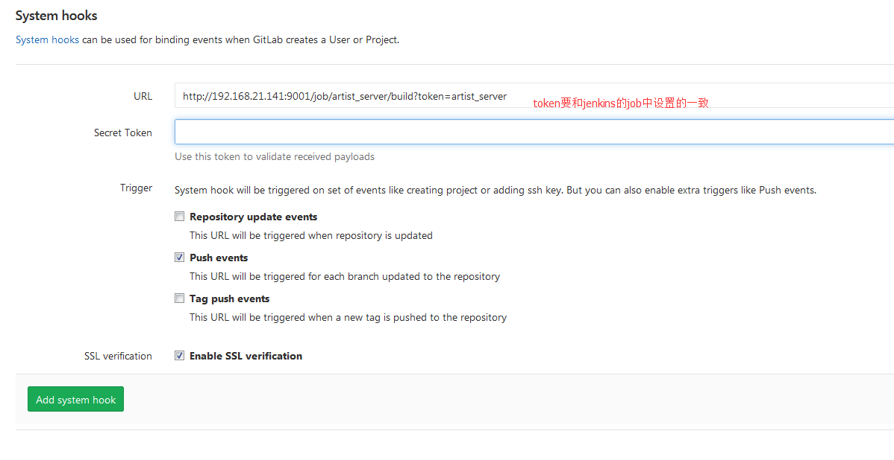
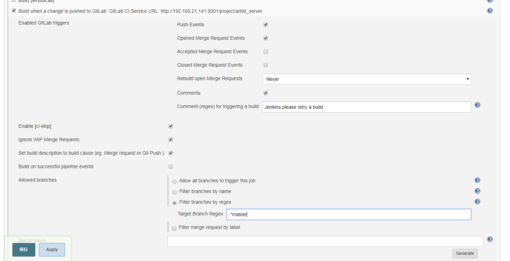

# Gitlab利用webhook实现push代码后触发Jenkins自动构建

##宿机上操作
* 生成ssh key 
<pre><code>
$ ssh-keygen -t rsa
</code></pre>
## Jenkins上的操作
### 安装gitlab hook plugin
通常，jenkins在项目配置时是可以配置远程构建触发器，设置好jenkins的回调url后就可以让jenkins进行自动构建。这就需要先下载Gitlab Hook Plugin 插件。登陆Jenkins，分别点击"系统管理"->"插件管理"->"可选插件"，选择Gitlab Hook Plugin

* 插件安装
	* gitlab plugin
	* gitlab webhook plugin
	* Maven Integration plugin
	* Xcode integration 
	* Gradle plugin 
* 设置jenkins的jdk和maven
	* jdk设置
		
	* maven设置
		
* 配置GitLab插件,获得accessToken(创建一个用户jenkins，密码为jenkinspwd)
	
* jenkins中gitlab配置
	
	”Connection Name”随便填，“Git Host URL”填GitLab的访问地址，然后点“Add”——“jenkins”，如下所示：
	
	在弹出框里，“kind”选择“GitLab API Token”，将先前复制的“Private token”粘贴到“API token”输入框中，然后点击“Add”，如下所示：
	
	选择刚刚新建的“Credentials”，如下所示：
	
	设置完了，要测试一下能否连接成功，点击“test connection”,搭建是url地址不对出现了下面的错去
	
	连接成功
	
## jenkins创建Job
* 创建一个maven的job
	！[创建一个maven的job](images/docker_jenkins_gitlab/maven-job-create.png)
* 设置git
	
	
* pom设置
	

## webhook设置
### jenkins设置(token值可随便设置)

### gitlab设置

### test报错403错误时Hook
 executed successfully but returned HTTP 403，我们须要进入jenkins

 系统设置-Configure Global Security中，关闭（去掉勾选： 防止跨站点请求伪造），然后在点击gitlab
 webhooks test OK 返回201 成功，查看jenkins 项目自动构建啦

### 设置仅仅是在push代码时触发构建，不区分分支，如果区分分支jenkins中设置如下：

