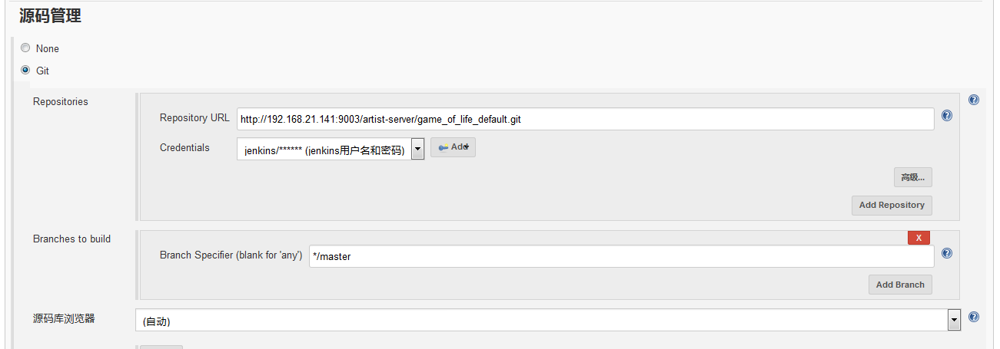
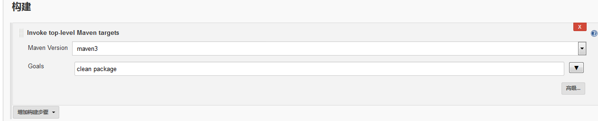
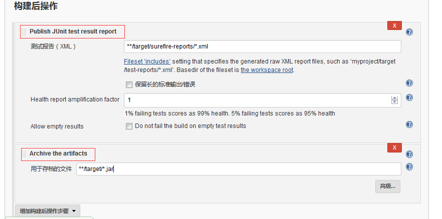
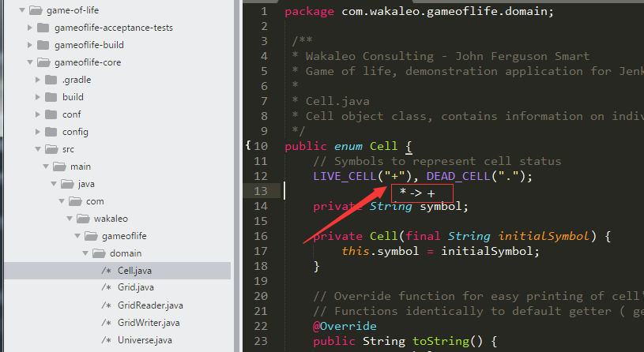
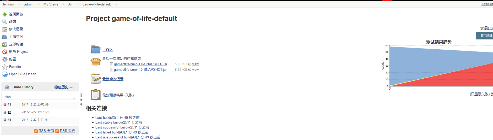
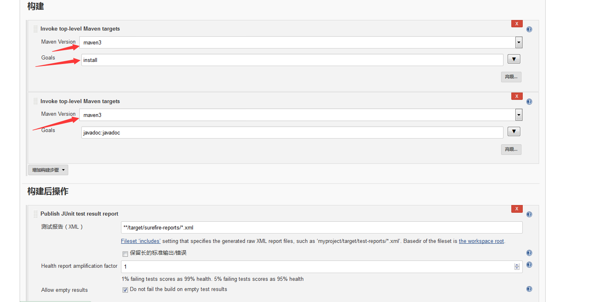

# Chapter2 #

## 基础配置
### jenkins部署完成后启动的界面(管理员用户和密码自己设置)

### jdk配置
系统管理->Global Tool Configuration(jdk采用宿机的jdk)

### maven配置
系统管理->Global Tool Configuration(maven采用宿机的maven)

### 设置git
git采用的是gitlab

[github示例代码](https://github.com/wakaleo/game-of-life)

将代码clone到本地，然后推送到gitlab中

[docker下gitlab安装](../../../docker/base/docker-gitlab.md)

### jenkins插件安装
系统管理->管理插件

* gitlab plugin
* gitlab webhook plugin
* Maven Integration plugin

### 创建第一个job：`game_of_life_default`

### 配置源码
采用的是自己的gitlab仓库，具体参考[docker下gitlab安装](../../../docker/base/docker-gitlab.md)

### 构建触发器设置
可以根据自己的需要设置不同条件下触发，也可以不设置，通过人工点击触发，在[Gitlab利用webhook实现push代码后触发Jenkins自动构建](../../../jenkins/jenkins_using/gitlab-webhook-jenkins.md)使用了钩子触发，每次push自动触发
### 添加构建步骤

### 构建后操作步骤
* 添加单元测试和构建物
红色框都是通过增加构建后操作步骤出现

### 修改代码

再次构建，结果失败

### 更多的报告-显示javadoc
增加构建步骤和构建后的步骤
maven版本要和前面的一致,注意标记的地方，相关命令进行了修改

构建完成后在构建的详细信息页面出现了只想javadoc的链接  

### 添加代码覆盖率
<pre><code>
ERROR: Step ‘Publish Cobertura Coverage Report’ failed: [Cobertura] Unable to find coverage results
</code></pre>