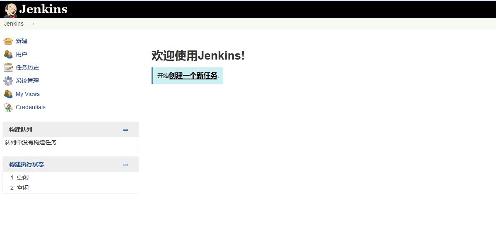

# Chapter2 #

## 基础配置
### jenkins部署完成后启动的界面(管理员用户和密码自己设置)

### jdk配置
系统管理->Global Tool Configuration(jdk采用宿机的jdk)

### maven配置
系统管理->Global Tool Configuration(maven采用宿机的maven)

### 设置git
git采用的是gitlab

[github示例代码](https://github.com/wakaleo/game-of-life)

将代码clone到本地，然后推送到gitlab中

[docker下gitlab安装](../../../docker/docker-gitlab.md)

### jenkins插件安装
系统管理->管理插件

* gitlab plugin
* gitlab webhook plugin
* Maven Integration plugin

### 创建第一个job：`game_of_life_default`

