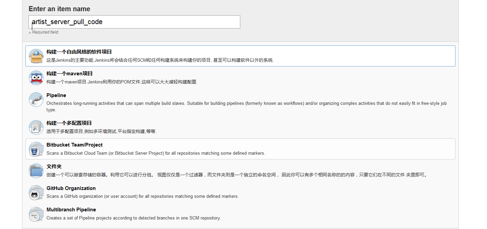
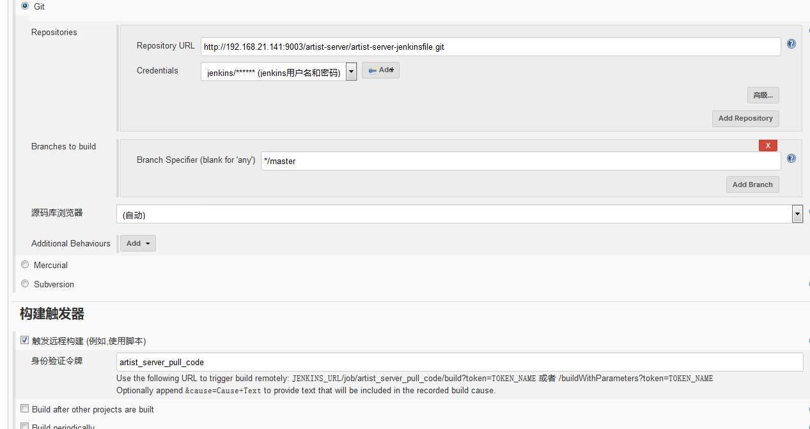
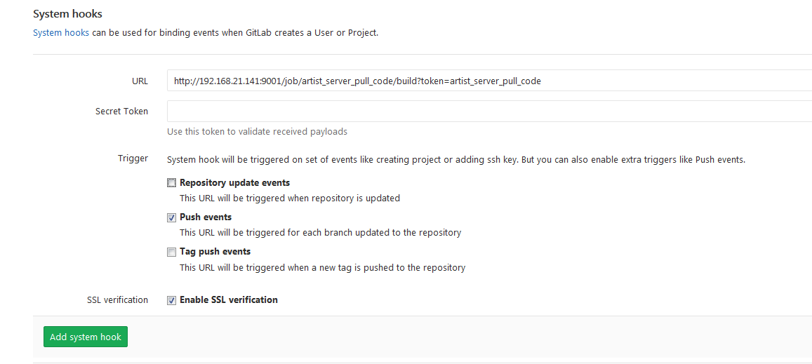
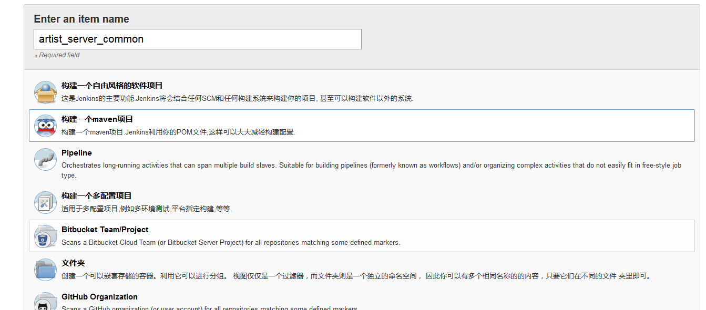
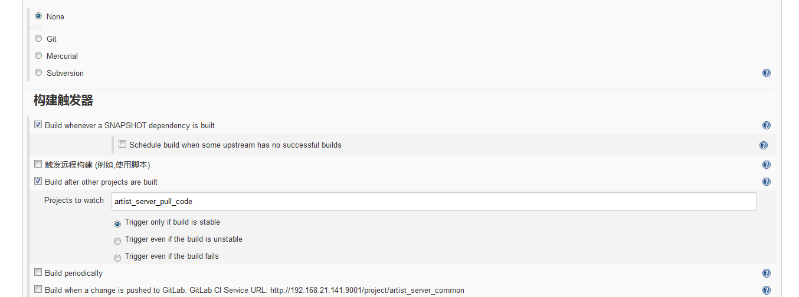

# Jenkins + Pipeline 分Job实现SpringCloud微服务CI
所有的微服务代码都在一个项目中

思路：先用一个job拉取代码，若存在公共module，为此module建立一个job，为每个微服务创建一个job，暂时不考虑只修改某个微服务代码的情况下只构建该微服务。

## 创建拉取代码job

* 创建job
    
* 设置代码仓库和构建触发器令牌
    
* gitlab上System Hooks创建
    

## 创建公共module的job

* 创建job
    
* 设置触发
    

