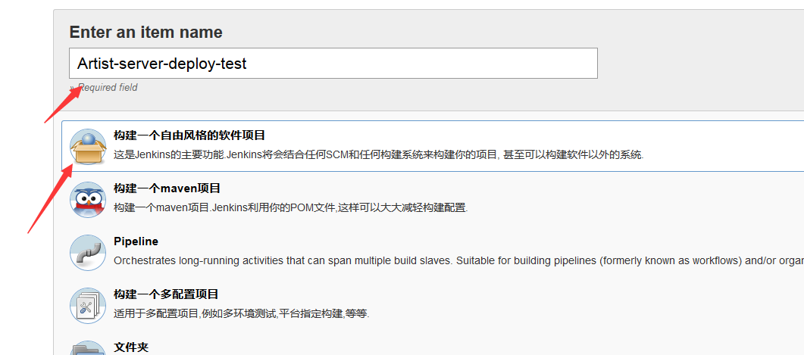
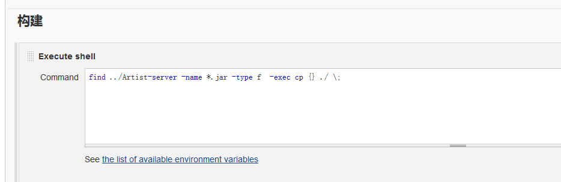
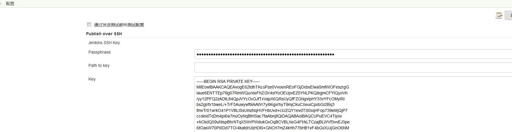
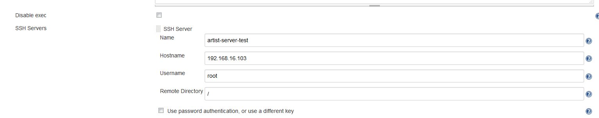
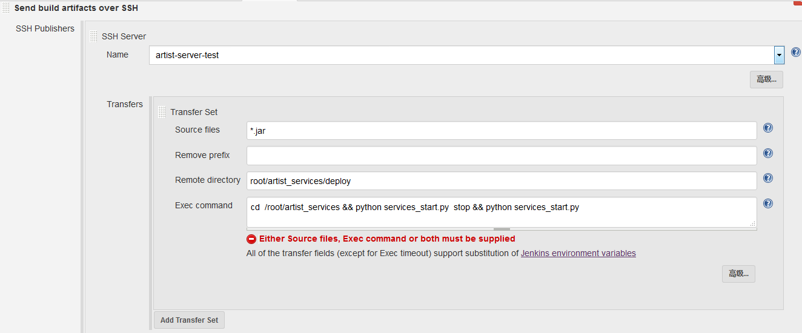

# Jenkins上传jar包到测试环境
[jenkins下pipelineJob请参考](jenkins_pipeline_flow.md)

## 新建一个job
* job为自由风格

* job设置

将Artist-server中的jar文件复制到当前job目录

## Publish Over SSH 部署
* 目标机器执行:` ssh-keygen -t rsa`
* 将id_rsa.pub的内容copy到jenkins机器中的authorized_keys中
* 将id_rsa中的内容copy到jenkins中的key中
    
    
* job中的配置
    