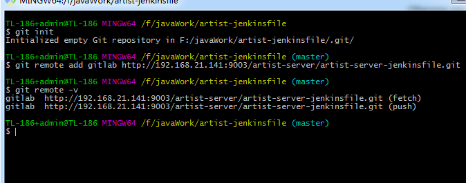
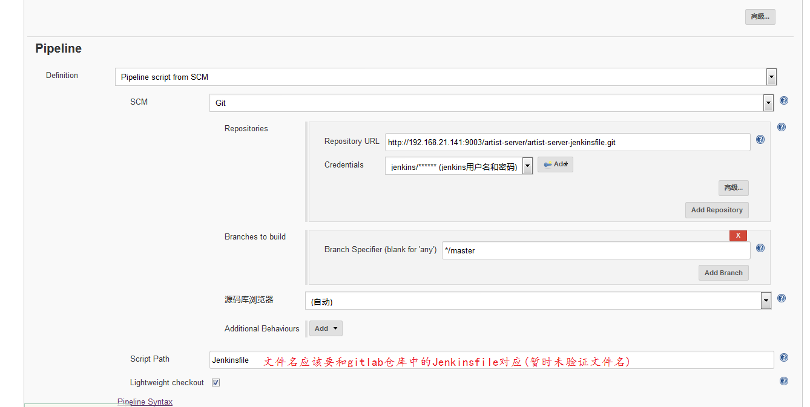
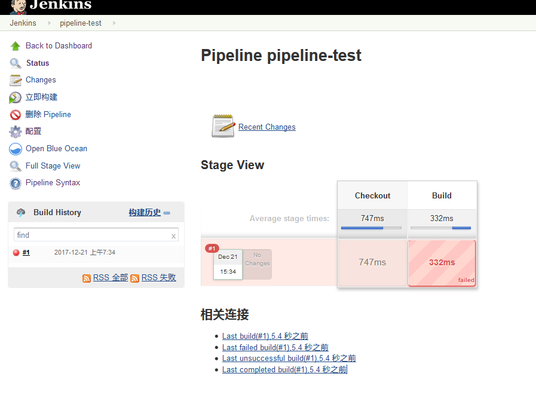

# Jenkins + Pipeline 构建流水线发布
git仓库采用的是gitlab
* gitlab创建项目(需要将gitlab用户jenkins加入到项目中，角色为master)

* 本地创建代码库

* 使用Pipeline Syntax
  
* 创建文件`Jenkinsfile`,输入下面的内容
<pre><code>
node {

  stage ('Checkout') {
    git credentialsId: 'c6ec95d8-04b9-4230-acf9-0df64c3ce669', url: 'http://192.168.21.141:9003/artist-server/artist-server.git'
  }

  stage ('Build') {
    sh 'cd server/artist && mvn clean && mvn package'
  }

  
}
</code></pre>

* 创建job
  
* Jenkins中pipeline-test中Pipeline设置
   
* 构建(暂时忽略错误)
  
* 查看文件结构,说明代码已经被拉取过来
截图经剪切处理，删除其他job
   

* 修改脚本(实际中修改过多次)
<pre><code>
node {

  stage ('Checkout') {
    git credentialsId: 'c6ec95d8-04b9-4230-acf9-0df64c3ce669', url: 'http://192.168.21.141:9003/artist-server/artist-server.git'
  }

  stage ('Build') {
    // sh 'cd server/artist && mvn clean && mvn package' 由于jenkins采用的是docker部署，未设置变量，故需要使用下面的命令
    // /usr/local/maven3在jenkins容器创建是使用 -v 加载宿机的maven(jdk也从宿机加载)
    sh 'cd server/artist && /usr/local/maven3/bin/mvn clean && /usr/local/maven3/bin/mvn package'
    
  } 
  
}
</code></pre>

* 再次构建，成功

