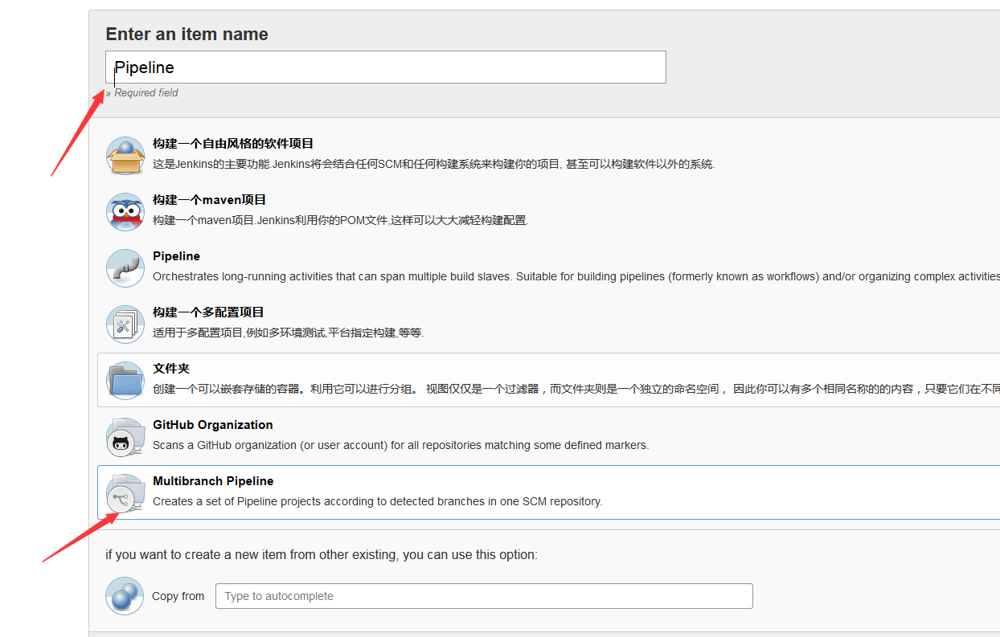
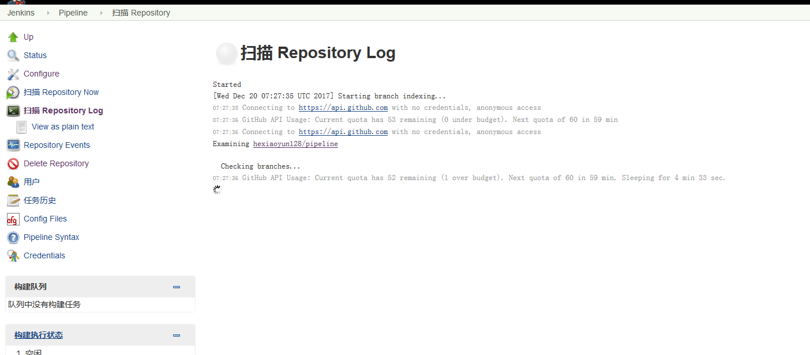

# Jenkins Pipeline 使用 #
## 基础数据准备
* github上创建pipeline仓库:[仓库地址](https://github.com/hexiaoyun128/pipeline.git)
* 本地创建pipeline文件夹，并新建文件Jenkinsfile,将下面的内容写入文件中
	<pre><code>
		pipeline {
		    agent { docker 'maven:3.3.3' }
		    stages {
		        stage('build') {
		            steps {
		                sh 'mvn --version'
		            }
		        }
		    }
		}
	</code></pre>
* 将代码推动github仓库中
* 
## 创建Pipeline

## 添加代码源

### 保存后会自动拉取代码
